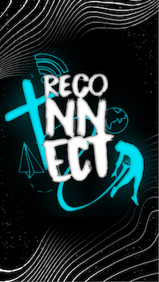
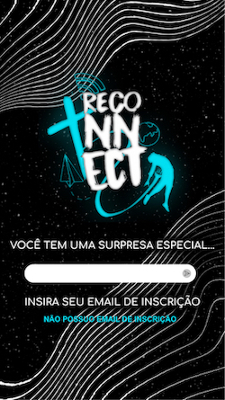

<p align="center">
    
</p>


# App culto Reconnect

App PWA para o evento na Igreja do Evangelho Quadrangular de São Calos-SP a ser realizado pelo grupo de jovens no dia 02/10/2021. Este projeto está feito com uma APO em modo POC em JSON-SERVER. 
**SINTA-SE A VONTADE PARA ALTERAR COMO QUISER**

Tecnologias
---
<p align="center"></p>

---

## Prints da PWA para dispositivos _Mobile_
   

## Passos para iniciar os serviços

1. É necessário que os pacotes tenham sido instalados
    - `git clone https://github.com/tonmarcondes/cultoReconnect.git`
    - `cd cultoReconnect`
    - `npm install`

2. [Iniciar a API](#servidor-de-api)
3. [Rodar o App](#rodar-aplicação-pwa)
4. [Gerar linlk externo](#ngrok)

## Servidor de API

> Liga o banco de dados do JSON-SERVER em http://localhost:3000

```bash
  $ cd server
  $ json-server --watch db.json
```

<a id="2"></a> 
## Rodar Aplicação PWA

> Inicia a aplicação em http://localhost:5000

```bash
  $ ng build 
  $ cd dist/cultoReconnect
  $ npx serve
```

<a id="3"></a> 
## NGROK

> libera a aplicação da rede interna para fora

```bash
$ ./ngrok http 5000
```
